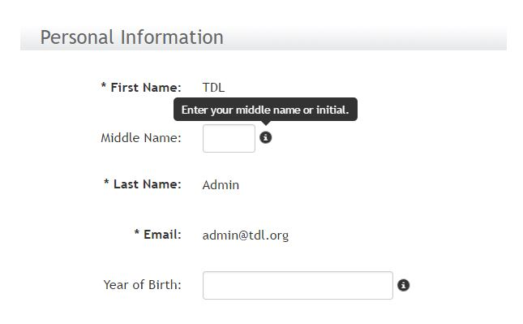

Design
=========

Aesthetic and Minimalist Design
--------------------------------
One of the main focuses of the service will be on the design of its UI and functionality
to be as focused as possible. The primary way I am going to focus on achieve that will be
to limit the amount of controls on the finder portion itself until they are needed by the
user. One example of this would be to add drop down menus for the more auxiliary controls
to ensure that the user only sees them if they see the context for the menu and determines
that it would help their experience. 

Help and Documentation
------------------------
The other main focus of the site will be about being as transparent as possible about the 
functionality of the site and its controls. They main way that I will try to ensure this will
be to add help pop-ups where necessary in order to conform to my other design principle of 
minimalist design while still having documentation ready to clarify features. Hovering
over a (*i*) symbol or drop-down menu will show additional context for that control/menu
but will hide it when unnecessary to avoid slowing down the user. 

A good example of the end result will be something like this:

