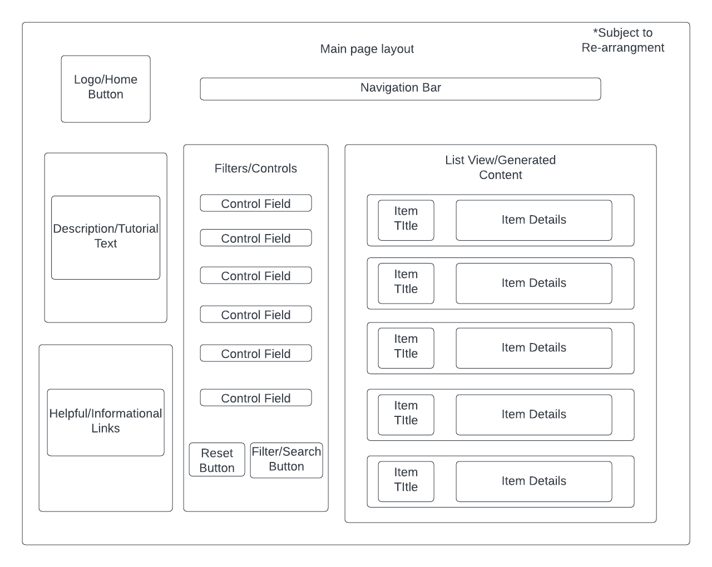

FoodFinder
===========
Welcome to FoodFinder! This website will be about getting the most out of your ingredients.
Have you ever looked in your fridge and been confused on what to make for dinner? Now you can
simply generate a list of possible recipes with the ingredients you have available! Other services
that may be added in the future include recipe steps included in the generation and resturant lookup
based on food types or calorie/macro nutrients requirements. The user may also have access to an account
system in the future for saving recipes/prefferences to save time. The core features of this website
are mainly going to be about retrieving recipes that match a given set of requirements and returning a 
list of recipes that match that requirement. The website will also include a blog like page for
my own personal recipes and ideas.

Web services
------------
- [The Meal DB](https://www.themealdb.com/api.php) Authentication Type: API Key
- [Zestful Data](https://zestfuldata.com/docs) Authentication Type: API Key
- [Spoonacular](https://spoonacular.com/food-api/docs) Authenication Type: API Key

### End Points
- www.themealdb.com/api/json/v1/1/search.php HTTP GET
- www.themealdb.com/api/json/v1/1/categories.php HTTP GET
- https://api.spoonacular.com/recipes/findByIngredients HTTP GET
- https://zestfuldata.com/parseIngredients HTTP GET

Database
---------
The data will that will be stored will be mainly recipe data in the form of a few 
related tables. I will have a recipe table to store the data about the recipes available 
on the site. I will have an ingredient table and ingredient list table to store the ingredients
that each recipe has. The ingredient table will store indivudual ingredients and their descriptions
while the ingredient list will store the amount used and their associated recipe from the recipe table.
Some other database tables that the website may include (if there is time) would be a resturant 
table with accompanying menu table and a steps table to store the steps of the recipes. 

Initial Designs
----------------

